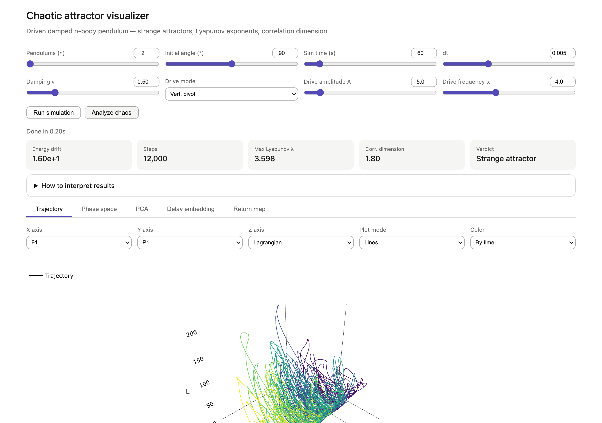

# Chaotic n-Pendulum Visualizer

Interactive 3D visualization of strange attractors in driven, damped n-body pendulum systems. Simulate a chain of 2 to 20 pendulums, then measure whether the motion is chaotic using Lyapunov exponents and correlation dimension, and explore the attractor through five different views.

**[Live demo](https://aaasocial.github.io/Chaotic-n-Pendulums-Visualizer/)** · Single HTML file · No build step · MIT



## Features

**Simulation**
- Chain of 2 to 20 equal pendulums released from rest at a chosen angle
- Hamiltonian formulation integrated with 4th-order Runge-Kutta
- Linear damping γ
- Three drive modes: uniform torque, horizontally oscillating pivot, vertically oscillating pivot (Kapitza-style parametric drive)
- Energy drift readout to check the integrator when γ = 0

**Chaos analysis**
- Maximum Lyapunov exponent via the Benettin renormalization method, with a running-estimate plot
- Correlation dimension via the Grassberger-Procaccia algorithm, with the log C(r) vs log r fit shown
- Automatic verdict: *Strange attractor*, *Chaotic*, *Fractal, not chaotic*, or *Not chaotic*

**Views**
- **Trajectory** — 3D plot of any three state variables (θᵢ, Pᵢ, or the Lagrangian), colored by time or solid
- **Phase space** — θ vs P for each pendulum with adjustable trail length and per-pendulum colors
- **PCA** — top three principal components of the full 2n+1 dimensional phase space, with variance explained
- **Delay embedding** — Takens reconstruction (x(t), x(t+τ), x(t+2τ)) from a single variable, with automatic τ from the autocorrelation
- **Return map** — x(t+T) vs x(t), with T taken from the drive period or estimated from the autocorrelation

**Playback**
- Play, pause, scrub, and speeds from 0.05× to 32×
- Light and dark themes following your system preference

## Quick start

Open the live demo, or run it locally:

```bash
git clone https://github.com/aaasocial/Chaotic-n-Pendulums-Visualizer.git
cd Chaotic-n-Pendulums-Visualizer
open index.html        # macOS; or double-click the file
```

That's it. There is no build, no `npm install`, and no server required. On Linux use `xdg-open index.html`, on Windows `start index.html`.

**Requirements:** any current browser (Chrome, Firefox, Safari, Edge) and an internet connection on first load. The only external dependency is [Plotly.js 2.35.0](https://plotly.com/javascript/), pinned and loaded from jsDelivr.

## Usage

1. Set the number of pendulums, initial angle, simulation time, and time step.
2. Optionally add damping and a drive. Without either, the system is conservative and will not settle onto an attractor.
3. Click **Run simulation**. The energy drift and step count update when it finishes.
4. Click **Analyze chaos** to compute the Lyapunov exponent and correlation dimension. This re-integrates the system once per pendulum, so it takes roughly n times longer than the simulation.
5. Switch tabs to explore the result. Use the playback controls at the bottom to animate any view.

### Worked example: a strange attractor

| Setting | Value |
|---|---|
| Pendulums (n) | 2 |
| Initial angle | 90° |
| Sim time | 60 s |
| dt | 0.005 |
| Damping γ | 0.5 |
| Drive mode | Vert. pivot |
| Drive amplitude A | 5.0 |
| Drive frequency ω | 4.0 |

Run the simulation, then click **Analyze chaos**. You should see a Max Lyapunov λ around 3.6, a correlation dimension around 1.8, and the verdict *Strange attractor*. The screenshot at the top of this page is this exact run. The drive also makes the Return map tab interesting: click **Auto period** and the drive period (2π/ω, about 1.57 s) is picked up automatically.

More generally, a small chain (n = 2 or 3), moderate damping (γ between 0.3 and 0.5), any drive mode with amplitude 5 or more, and at least 60 seconds of simulation reliably produce a strange attractor. Low amplitudes (A = 2) with higher damping tend to settle onto a periodic orbit instead. The analysis skips the first 20% of the run to discard the transient.

### Controls

| Control | Range | Notes |
|---|---|---|
| Pendulums (n) | 2 to 20 | Cost per step grows as O(n³) |
| Initial angle | 10° to 170° | All pendulums start at this angle, at rest |
| Sim time | 2 to 600 s | |
| dt | 0.01, 0.005, 0.002, 0.001 s | Smaller is more accurate and slower |
| Damping γ | 0 to 2.5 | Applied to every canonical momentum |
| Drive mode | None, Uniform torque, Horiz. pivot, Vert. pivot | |
| Drive amplitude A | 0 to 50 | Torque for uniform mode, pivot displacement for pivot modes |
| Drive frequency ω | 0.1 to 10 rad/s | |

### Interpreting results

| Readout | Meaning |
|---|---|
| **Max Lyapunov λ** | Positive means nearby trajectories diverge exponentially. The verdict uses λ > 0.1 as the chaos threshold. |
| **Correlation dimension** | A non-integer value indicates a fractal attractor. The verdict treats a fractional part between 0.1 and 0.9 as non-integer. The estimate uses only 600 points, so it is coarse. A clean periodic orbit often reads 1.1 to 1.4 rather than exactly 1, which produces the *Fractal, not chaotic* verdict. |
| **Energy drift** | Change in the Hamiltonian over the run. For γ = 0 and no drive this should be small. Large drift means dt is too big. |
| **Verdict** | λ > 0.1 **and** non-integer dimension gives *Strange attractor*. Note that the undamped, undriven chain can also trigger this verdict because it is chaotic and the dimension estimate is coarse. A true strange attractor requires dissipation, so check that γ > 0 before trusting the label. |

## How it works

### Physical model

The chain has n identical segments, each of length 1/n and mass 1/n, so the whole pendulum has unit length and unit mass. Gravity is g = 9.8 m/s². The state is the vector of angles θ and canonical momenta P.

The kinetic energy is T = (n³/2) Pᵀ A⁻¹ P, where A is the configuration-dependent mass matrix

```
A[i][j] = (n − max(i, j)) · cos(θᵢ − θⱼ)
```

and the potential is V = −(g/n²) Σⱼ (n − j) cos θⱼ. Hamilton's equations give θ̇ = n³ A⁻¹ P and Ṗ from the gradient of T and V. The mass matrix is inverted by Gauss-Jordan elimination at every evaluation, which is where the O(n³) cost comes from.

Damping subtracts γ·n·Pᵢ from each momentum derivative. The drives add:

| Mode | Added to Ṗᵢ |
|---|---|
| Uniform torque | A sin(ωt) |
| Horizontal pivot | −(1/n) A ω² (n − i) sin(ωt) cos θᵢ |
| Vertical pivot | +(1/n) A ω² (n − i) sin(ωt) sin θᵢ |

The pivot modes correspond to a support point oscillating with displacement A sin(ωt), written in the pivot's accelerating frame.

### Chaos measures

**Lyapunov exponent.** For each pendulum in turn, a shadow trajectory is started with that pendulum's angle perturbed by 10⁻⁷. Both are integrated with the same RK4 step. Every 0.5 s of simulated time the separation d is measured, log(d/ε) is accumulated, and the shadow is pulled back to distance ε along the separation direction. The exponent is the average log growth rate, and the largest value across pendulums is reported.

**Correlation dimension.** The three variables currently selected on the Trajectory tab are subsampled to about 600 points. All pairwise distances are sorted, the correlation sum C(r) is evaluated on 30 logarithmically spaced radii between the 1st and 80th percentile of distances, and the dimension is the slope of a least-squares line fit through the middle 60% of the log-log curve.

**Delay embedding.** Auto τ picks the first lag where the autocorrelation of the chosen variable crosses zero or turns upward.

**Return map.** If a drive is active, T is the drive period 2π/ω. Otherwise T is the first lag where the autocorrelation recovers above 0.5 after its first zero crossing.

**PCA.** The 2n+1 variables (all θ, all P, and the Lagrangian) are standardized, the covariance matrix is formed, and the top three eigenvectors are found by power iteration with deflation.

## Performance notes

- Everything runs on the main thread. Long simulations with many pendulums and small dt will freeze the page until they finish. Start small and scale up.
- Simulation cost is roughly (sim time / dt) × n³. Chaos analysis multiplies that by n.
- Correlation dimension is capped at 600 points to keep the pairwise distance computation fast, so the estimate is coarse.
- If the mass matrix becomes singular the integrator stops early and the step count will be smaller than expected.

## Project structure

```
index.html   All markup, styles, physics, analysis, and plotting in one file
LICENSE      MIT
```

## Contributing

Issues and pull requests are welcome. Since the whole project is one file, the easiest way to experiment is to open `index.html` in a browser, edit, and refresh.

Ideas that would help:
- Move the simulation and Lyapunov computation into a Web Worker so the UI stays responsive
- Configurable per-segment masses and lengths
- Export of trajectories as CSV
- Poincaré sections for driven systems

## License

MIT © 2026 [aaasocial](https://github.com/aaasocial). See [LICENSE](LICENSE).
